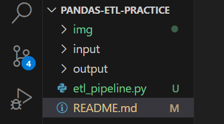

# Basic CSV-Based ETL Pipeline in Python

## Project Goal
As part of my learning journey in Python and data engineering, I built a basic ETL (Extract, Transform, Load) pipeline using pandas. The purpose of this project is to practice how to:

- Read data from a CSV file

- Clean and transform it

- Save the cleaned data to a new file

This project helps me understand the flow of **ETL pipelines** using **Python scripts** in a simple and structured way.

### Tools I Used
- **VS Code:** My code editor for writing scripts
- **Python:** Programming language I’m learning
- **Pandas:** For reading, cleaning, and saving data
- **GitHub:** To store and track my project online

## Folder Setup

Here’s how I organized the project folders and files:

```
pandas-etl-practice/
├── input/
│   └── employees.csv           # raw data file
├── output/
│   └── cleaned_employees.csv   # cleaned data (output)
├── etl_pipeline.py             # main Python script
└── README.md                   # documentation for the project
```

## Steps I Took

### Step 1: Created a GitHub Repository and Cloned It

I started by creating a new public repository on GitHub and named it:

```
pandas-etl-practice
```


Then I cloned it to my local machine using the terminal:

```bash
git clone https://github.com/myusername/pandas-etl-practice.git
```

I navigated into the project folder and opened it with VS Code:

```bash
cd pandas-etl-practice
code .
```


## Step 2: Organized My Project Directory

Inside VS Code, I created the following:

- A folder named `input/` to store the raw data file

- A folder named `output/` where the cleaned file will be saved

- A Python file named `etl_pipeline.py` where I wrote my **ETL logic**



## Step 3: Added Sample Data

Inside the `input/` folder, I created a file named `employees.csv` and added the following sample content:

```
id,name,age,department,salary
1,Adams Nonye,29,Engineering,70000
2,Chukwufunanya Osai,NaN,Marketing,55000
3,Janet Iliya,45,,60000
4,Onyebuchi Akor,34,Sales,NaN
5,Musa Ibrahim,38,Engineering,72000
```


This CSV file contains missing values that will be handled during the transform stage.

## Step 4: Installed pandas Library

To use pandas in my script, I installed it by running this command in the integrated terminal in VS Code:

```bash
pip install pandas
```

To verify:

```bash
f2py -v
```


## Step 5: Wrote the Python Script (etl_pipeline.py)

Then I wrote this Python script to perform the ETL process:

```bash
import pandas as pd  # Importing pandas for working with tabular data

# STEP 1: EXTRACT
def extract_data(file_path):
    """
    Reads a CSV file into a pandas DataFrame.
    """
    df = pd.read_csv(file_path)
    print("✅ Extracted Data:")
    print(df)
    return df

# STEP 2: TRANSFORM
def transform_data(df):
    """
    Cleans the data:
    - Removes rows where department or salary is missing
    - Fills missing ages with the average age
    - Converts salary to integer type
    """
    df = df.dropna(subset=['department', 'salary'])  # remove rows with missing critical data
    df['age'].fillna(df['age'].mean(), inplace=True)  # fill missing ages with average
    df['salary'] = df['salary'].astype(int)  # convert salary to int
    print("✅ Transformed Data:")
    print(df)
    return df

# STEP 3: LOAD
def load_data(df, output_file_path):
    """
    Saves the cleaned DataFrame to a CSV file.
    """
    df.to_csv(output_file_path, index=False)
    print(f"✅ Cleaned data saved to {output_file_path}")

# MAIN FUNCTION
def main():
    """
    Controls the flow: Extract ➝ Transform ➝ Load
    """
    input_path = 'input/employees.csv'
    output_path = 'output/cleaned_employees.csv'

    df = extract_data(input_path)
    cleaned_df = transform_data(df)
    load_data(cleaned_df, output_path)

# Run the pipeline
if __name__ == '__main__':
    main()
```

## Step 6: Ran the Script

I ran the script from the terminal inside VS Code using:

```bash
python etl_pipeline.py
```

After running it:

- The original and cleaned data were printed to the terminal

    

    

- A cleaned CSV file was created in the output/ folder as `cleaned_employees.csv`

    


## What I Learned

- How to create and manage a Python project in VS Code

- Basic ETL concepts: Extract, Transform, and Load

- How to use pandas to read, clean, and write CSV data

- How to structure a script with functions for each stage